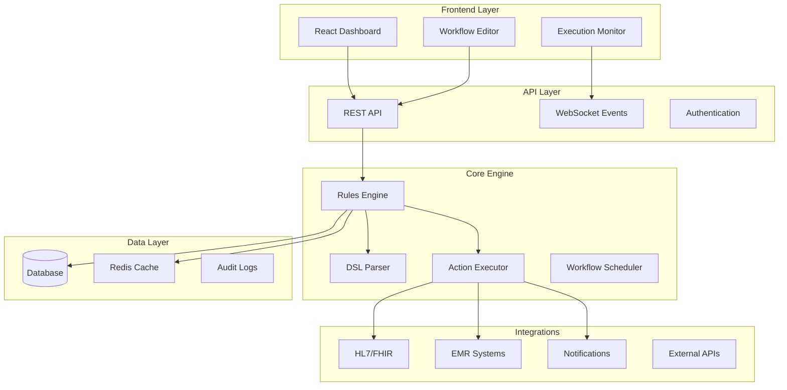

# Clinical FIRE 🔥

**Fast Interoperable Rules Engine for Healthcare Workflows**

[](https://www.typescriptlang.org/)
[](https://reactjs.org/)
[](https://nodejs.org/)

Clinical FIRE is a modern, TypeScript-based workflow automation platform designed specifically for healthcare environments. It provides a powerful rules engine that enables healthcare organizations to automate clinical workflows, improve patient care coordination, and reduce manual processes.

## 🌟 Features

### 🚀 **Core Capabilities**
- **Declarative Workflow Definition** - Define workflows using YAML or JSON DSL
- **Real-time Execution Engine** - Process workflows with millisecond latency
- **Healthcare Integrations** - Native support for HL7, FHIR, and EMR systems
- **Flexible Trigger System** - Lab results, vital signs, forms, appointments, and more
- **Rich Action Library** - Notifications, care plans, scheduling, webhooks, and custom actions

### 🏥 **Healthcare-Specific Features**
- **Clinical Data Models** - Built-in support for patients, providers, medications, lab results
- **Care Plan Automation** - Generate and execute evidence-based care protocols
- **Alert Management** - Critical value notifications with escalation rules
- **Audit Logging** - Comprehensive tracking for compliance and analysis
- **Role-Based Access** - Secure access control for different healthcare roles

### 💻 **Technical Excellence**
- **Type-Safe Architecture** - Full TypeScript implementation with strict typing
- **Microservices Ready** - Modular design with clear service boundaries
- **High Performance** - Optimized for concurrent workflow execution
- **Extensible Plugin System** - Easy integration of custom actions and triggers
- **Modern UI** - React-based dashboard with shadcn/ui components

## 🏗️ Architecture



## 🚀 Quick Start

### Prerequisites
- Node.js 18+ 
- npm 9+
- Git

### Installation

1. **Clone the repository**
```bash
git clone https://github.com/berkdurmus/clinical-fire.git
cd clinical-fire
```

2. **Install dependencies**
```bash
npm install
```

3. **Build the project**
```bash
npm run build
```

4. **Start the development environment**
```bash
# Start both API and frontend
npm start

# Or start individually
npm run api  # Starts API server on port 3001
npm run web  # Starts frontend on port 3000
```

5. **Access the application**
- Frontend: http://localhost:3000
- API: http://localhost:3001
- API Documentation: http://localhost:3001/api/docs

### Default Credentials
- **Email**: admin@clinical-fire.com
- **Password**: admin123

## 📋 Example Workflows

### Critical Lab Alert
```yaml
name: "Critical Lab Alert"
version: "1.0.0"
description: "Alert care team when critical lab values are detected"
enabled: true

triggers:
  - type: "lab_result_received"
    conditions:
      - field: "test_type"
        operator: "equals"
        value: "troponin"
      - field: "value"
        operator: "greater_than"
        value: 0.04

actions:
  - type: "notify_doctor"
    params:
      urgency: "high"
      message: "Critical troponin level: {{value}} ng/mL"
      recipients: ["on_call_cardiologist"]
  
  - type: "create_care_plan"
    params:
      template: "acute_mi_protocol"
      auto_schedule: true
  
  - type: "log_event"
    params:
      category: "critical_alert"
      severity: "high"
```

### Medication Adherence
```yaml
name: "Medication Adherence Check"
version: "1.0.0"
description: "Monitor and improve medication adherence"

triggers:
  - type: "time_based"
    conditions:
      - field: "schedule"
        operator: "equals"
        value: "daily_8am"

actions:
  - type: "api_call"
    params:
      url: "{{emr_base_url}}/patients/{{patient_id}}/medications"
      method: "GET"
  
  - type: "notify_patient"
    conditions:
      - field: "last_dose_taken"
        operator: "greater_than"
        value: "24_hours_ago"
    params:
      message: "Reminder: Please take your prescribed medication"
      channel: "mobile_app"
```

### Discharge Planning
```yaml
name: "Automatic Discharge Planning"
version: "1.0.0"
description: "Streamline discharge process and follow-up care"

triggers:
  - type: "patient_status_changed"
    conditions:
      - field: "status"
        operator: "equals"
        value: "discharge_ready"

actions:
  - type: "create_care_plan"
    params:
      template: "discharge_template"
      include_followup: true
  
  - type: "schedule_appointment"
    params:
      appointment_type: "follow_up"
      days_from_discharge: 7
      provider_specialty: "{{attending_specialty}}"
  
  - type: "send_email"
    params:
      to: "{{patient_email}}"
      subject: "Discharge Instructions and Follow-up Care"
      template: "discharge_instructions"
```

## 📊 Workflow DSL Reference

### Triggers
| Type | Description | Common Use Cases |
|------|-------------|------------------|
| `lab_result_received` | New lab results | Critical values, trend monitoring |
| `vital_signs_updated` | Vital sign changes | Early warning systems |
| `form_submitted` | Form completion | Admission, assessment forms |
| `medication_prescribed` | New prescriptions | Drug interactions, allergies |
| `time_based` | Scheduled triggers | Reminders, routine checks |
| `patient_admitted` | Patient admission | Care protocols, notifications |

### Actions
| Type | Description | Parameters |
|------|-------------|------------|
| `notify_doctor` | Alert physician | `urgency`, `message`, `recipients` |
| `notify_nurse` | Alert nursing staff | `message`, `ward`, `urgency` |
| `create_care_plan` | Generate care plan | `template`, `auto_schedule` |
| `schedule_appointment` | Book appointments | `provider`, `date`, `type` |
| `send_email` | Email communication | `to`, `subject`, `template` |
| `webhook` | External API calls | `url`, `method`, `headers` |
| `log_event` | Audit logging | `category`, `severity`, `details` |

### Conditions
| Operator | Description | Example |
|----------|-------------|---------|
| `equals` | Exact match | `status equals "critical"` |
| `greater_than` | Numeric comparison | `value greater_than 100` |
| `contains` | Text contains | `diagnosis contains "diabetes"` |
| `in` | Value in list | `department in ["ICU", "ER"]` |
| `regex` | Pattern matching | `patient_id regex "^PT[0-9]+"` |

## 🔧 Development

### Project Structure
```
clinical-fire/
├── packages/
│   ├── shared/          # Common types and utilities
│   ├── core/            # Rules engine and workflow logic
│   ├── api/             # REST API server
│   └── web/             # React frontend
├── examples/            # Example workflows
├── docs/               # Documentation
└── docker/             # Docker configurations
```

### Development Scripts
```bash
# Development
npm run dev              # Start all services in development mode
npm run build           # Build all packages
npm run lint            # Run linting
npm run test            # Run tests
npm run type-check      # TypeScript type checking

# Package-specific
npm run dev --workspace=@clinical-fire/api   # API only
npm run dev --workspace=@clinical-fire/web   # Frontend only
```

### Adding New Actions

1. **Create Action Handler**
```typescript
// packages/core/src/actions/my-action.handler.ts
import { ExecutionContext } from '@/shared';
import { Logger } from '../utils/logger';

export class MyActionHandler {
  constructor(private logger: Logger) {}

  async handle(params: Record<string, any>, context: ExecutionContext) {
    // Implementation
  }
}
```

2. **Register in Action Executor**
```typescript
// packages/core/src/engine/action.executor.ts
case 'my_action':
  return await this.myActionHandler.handle(interpolatedParams, context);
```

3. **Add to Type Definitions**
```typescript
// packages/shared/src/types/workflow.types.ts
export const ActionTypeSchema = z.enum([
  // ... existing actions
  'my_action',
]);
```

## 🚀 Deployment

### Docker Deployment
```bash
# Build images
docker-compose build

# Start services
docker-compose up -d

# View logs
docker-compose logs -f
```

### Environment Variables
```bash
# API Configuration
PORT=3001
NODE_ENV=production
DATABASE_PATH=./data/clinical-fire.db
JWT_SECRET=your-secret-key

# Frontend Configuration
NEXT_PUBLIC_API_URL=http://localhost:3001
```

### Production Considerations
- Use PostgreSQL instead of SQLite for production
- Set up Redis for caching and session management
- Configure proper authentication (OAuth, SAML)
- Implement proper logging and monitoring
- Set up SSL/TLS certificates
- Configure rate limiting and security headers

## 🏥 Healthcare Integration

### HL7/FHIR Support
```typescript
// Example: Processing HL7 messages
const hl7Message = {
  resourceType: "Observation",
  status: "final",
  code: { coding: [{ code: "33747-0", display: "Troponin I" }] },
  valueQuantity: { value: 0.06, unit: "ng/mL" }
};

// Trigger workflow
await workflowEngine.trigger({
  triggerType: "lab_result_received",
  data: hl7Message,
  patientId: "patient-123"
});
```

### EMR Integration
Clinical FIRE can integrate with major EMR systems:
- **Epic** - MyChart APIs, Epic on FHIR
- **Cerner** - PowerChart APIs, SMART on FHIR
- **Allscripts** - Developer Program APIs
- **Custom EMRs** - REST APIs, HL7 interfaces

## 📈 Monitoring & Analytics

### Built-in Metrics
- Workflow execution counts and success rates
- Average execution times per workflow
- Action-specific performance metrics
- Error rates and failure analysis
- Patient impact tracking

### Integration Options
- **Prometheus** - Metrics collection
- **Grafana** - Visualization dashboards
- **ELK Stack** - Log analysis
- **Datadog** - APM and monitoring

## 🔒 Security & Compliance

### Security Features
- JWT-based authentication
- Role-based access control (RBAC)
- API rate limiting
- Input validation and sanitization
- Audit logging for all operations

### Compliance Support
- **HIPAA** - Encrypted data, access controls, audit trails
- **SOC 2** - Security and availability controls
- **HL7** - Healthcare data exchange standards
- **FHIR R4** - Modern healthcare API standards

## 🤝 Contributing

We welcome contributions! Please see our [Contributing Guide](CONTRIBUTING.md) for details.

### Development Setup
1. Fork the repository
2. Create a feature branch (`git checkout -b feature/amazing-feature`)
3. Make your changes
4. Add tests for new functionality
5. Ensure all tests pass (`npm test`)
6. Commit your changes (`git commit -m 'Add amazing feature'`)
7. Push to the branch (`git push origin feature/amazing-feature`)
8. Open a Pull Request

## 📄 License

This project is licensed under the MIT License - see the [LICENSE](LICENSE) file for details.

## 🏆 Acknowledgments

This project was created to demonstrate modern healthcare workflow automation capabilities, showcasing:

- **Technical Excellence** - Full TypeScript implementation with enterprise-grade architecture
- **Healthcare Domain Knowledge** - Real-world clinical workflows and integrations  
- **Modern Development Practices** - Monorepo structure, comprehensive testing, CI/CD ready
- **Production Ready** - Security, monitoring, and scalability considerations

Clinical FIRE represents the intersection of cutting-edge technology and healthcare innovation, providing a solid foundation for building the next generation of clinical automation systems.

---

**Built with ❤️ for better healthcare outcomes** 